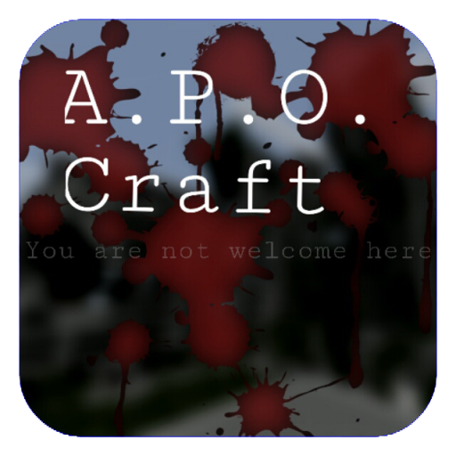

# A.P.O. Craft — Reborn Initiative

> [!NOTE]
> This project serves as a part of Reborn Initiative. Its primary objectives are restoring compatibility with newer game versions, implementing multiplayer functionality, and generally avoiding introduction of radically new features. All rights to this project belongs to [IchZerowan](https://github.com/IchZerowan).

It was a very ordinary day. Steve has just returned from his mine and was about to craft his first diamond sword. But suddenly, something went wrong. Time and space collapced. Surrounded by many lightneengs, Steve had no way to escape and was thrown out into a postapocalyptic city. Will he survive and create Stabilizer to get home or will be slained by hundreds of zombies and mutants? This is A.P.O. Craft. And you are not welcome here.
